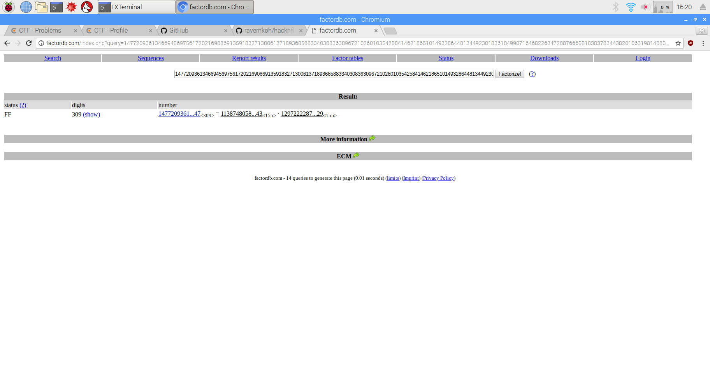

 # RSA Math 

This challenge is a really classic and simple RSA CTF challenge.

You are given N,C and e.

The first step to breaking RSA encryption is to factor N into its primes, p and q.

You can use factordb.com to do this.

From the picture, we can see that we have 2 155 digits factors. Those are our p and q.

After getting p and q, we can form our private exponent that is used for decryption, d.

To calculate d, we must first calculate phi(n), which is just (p-1) * (q-1).

After that, we can calculate d by finding the inverse mod of e and phi(n). We can use the pyCrypto library to help us do that. (Refer to `solve.py`)

After we get d, we can just simply decrypt C by finding the power of c to d mod n. In algebra terms, (c^d) % n.

Decode the decimal to ascii to get the flag.

## flag

`HNF{m4th_canc3r}` 
