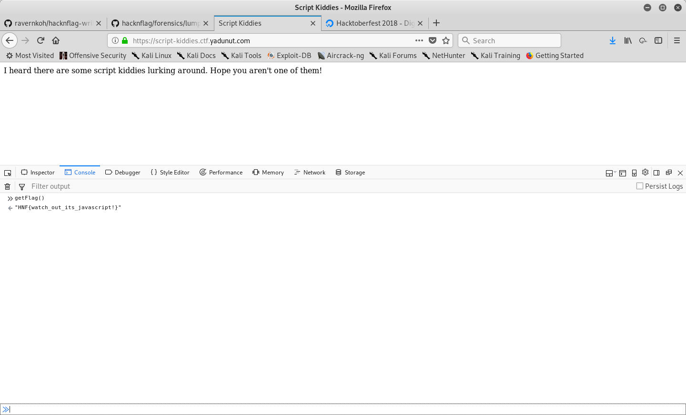

# Script Kiddies

When you 1st opened the webpage, you are greeted with a simple page with no input boxes.

This challenge was actually over-thought by most of the participants.

Most participants solved this by analyzing the javascript in the page source.

However, there is a much simpler way to do solve this challenge.

You can simply call the `getFlag` function from the developer's console for the flag.

## flag

`HNF{watch_out_its_javascript!}`
